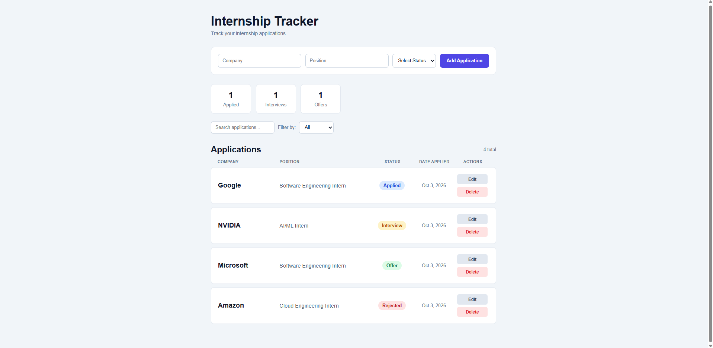

# Internship Tracker

A full-stack web application for tracking internship applications throughout the recruiting process.

## Preview

## Features

- Add internship applications with company, position, and status
- Edit and delete existing applications
- Search applications by company or position
- Filter applications by status
- Track applied, interview, and offer counts
- Automatically record application dates
- Store application data persistently in PostgreSQL
- Display error messages when API requests fail
- Responsive interface for different screen sizes

## Tech Stack

### Frontend
- React
- JavaScript
- Vite
- CSS

### Backend
- Python
- FastAPI
- PostgreSQL
- psycopg2

## How It Works

The React frontend communicates with a REST API built with FastAPI. The API handles creating, retrieving, updating, and deleting internship applications, with application data stored in a PostgreSQL database.

## Project Structure

internship-tracker/
├── backend/
│   └── main.py
├── frontend/
│   ├── public/
│   └── src/
│       ├── App.jsx
│       ├── ApplicationCard.jsx
│       └── App.css
└── README.md

## Future Improvements

- User authentication
- Application notes and deadlines
- Additional sorting options
- Deployment with a hosted PostgreSQL database